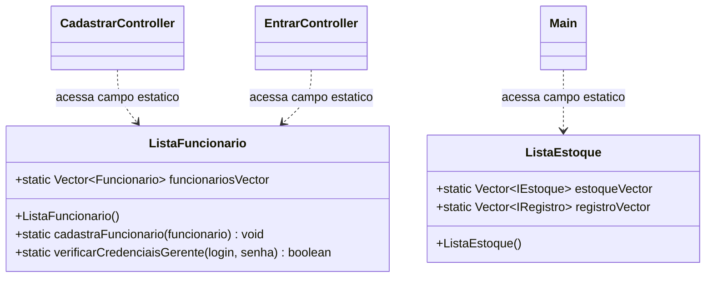
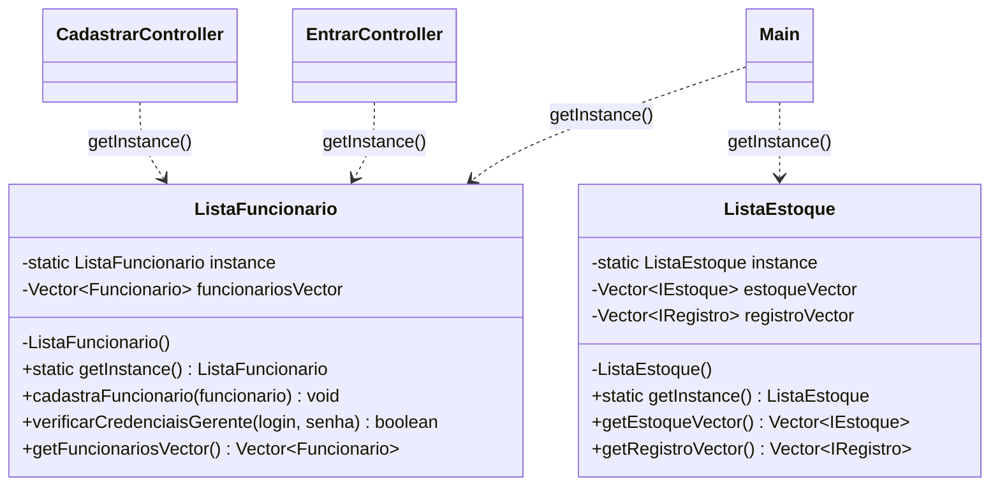
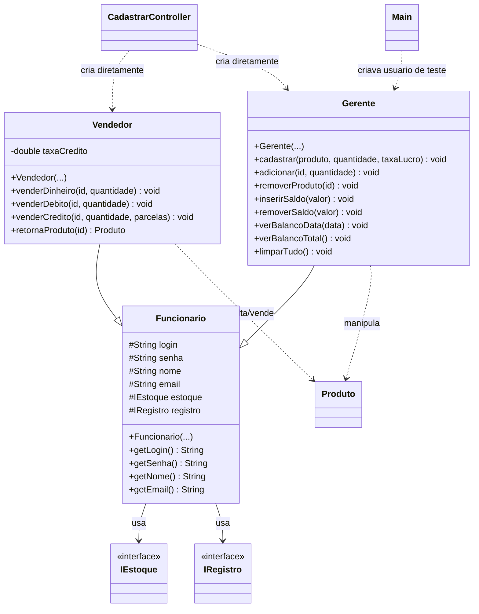
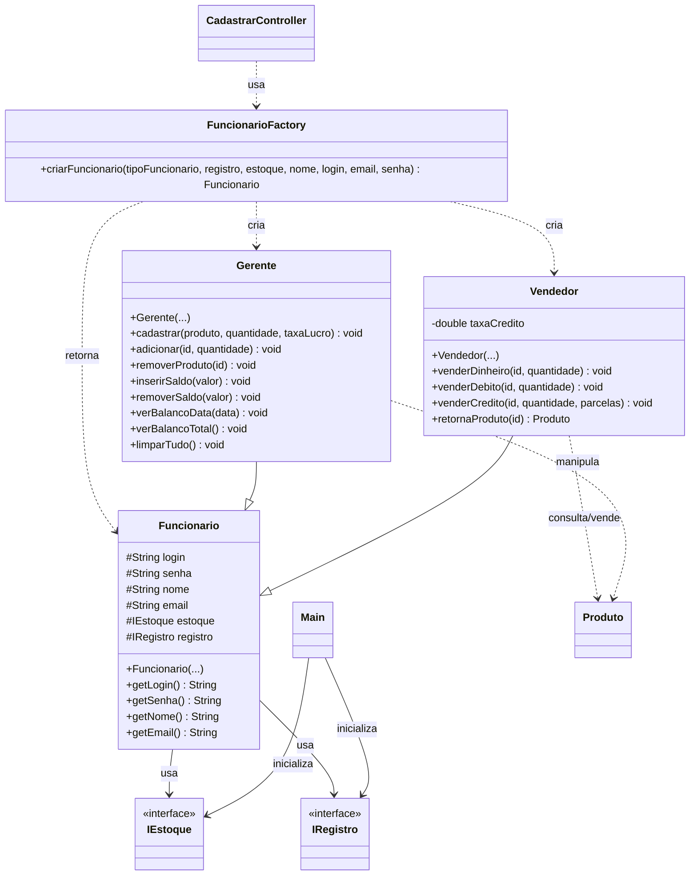

# ProjetoMercadoFX

Sistema de mercadinho desenvolvido em JavaFX para exercicios de Programacao Orientada a Objetos e Padroes de Software.

## Objetivo do relatorio

Este relatorio descreve a aplicacao de dois padroes de projeto no sistema: **Singleton** e **Factory Method**.

| Padrao | Classes afetadas |
|---|---|
| Singleton | `ListaFuncionario`, `ListaEstoque` e todos os controllers |
| Factory Method | `FuncionarioFactory`, `CadastrarController` |

---

## Padrao 1 — Singleton

### Problema identificado

As classes `ListaFuncionario` e `ListaEstoque` usavam vetores **publicos e estaticos**. Qualquer parte do codigo podia modificar esses vetores diretamente e era possivel criar multiplas instancias dessas classes, resultando em estados inconsistentes.

```java
// Antes: acesso direto ao campo publico estatico
ListaFuncionario.funcionariosVector.add(funcionario);
ListaEstoque.estoqueVector.add(estoque);
```

### Estrutura antes do Singleton



### Estrutura depois do Singleton



### Implementacao aplicada

```java
public class ListaFuncionario {
    private static ListaFuncionario instance;
    private Vector<Funcionario> funcionariosVector;

    private ListaFuncionario() {
        this.funcionariosVector = new Vector<>();
    }

    public static ListaFuncionario getInstance() {
        if (instance == null) {
            instance = new ListaFuncionario();
        }
        return instance;
    }
}
```

Os controllers passaram a usar `getInstance()` em vez de acessar campos estaticos diretamente:

```java
// Antes
ListaFuncionario.verificarCredenciaisGerente(login, senha);

// Depois
ListaFuncionario.getInstance().verificarCredenciaisGerente(login, senha);
```

### Resultado

Ganhos obtidos com o Singleton:

- Construtor `private`: impossivel criar uma segunda instancia acidentalmente.
- Vetores deixaram de ser `public static`, expostos apenas via getters.
- `getInstance()` garante que toda a aplicacao compartilha o mesmo objeto.
- Bug de comparacao de Strings corrigido de `==` para `.equals()` nos controllers.

---

## Padrao 2 — Factory Method

### Problema identificado

O `CadastrarController` conhecia diretamente as classes concretas e criava os objetos com `new Gerente(...)` e `new Vendedor(...)`. Qualquer novo tipo de funcionario exigiria alteracoes diretas no controller.

### Estrutura antiga

Na estrutura anterior, a tela de cadastro estava acoplada diretamente as subclasses de `Funcionario`.



#### Problema identificado

O principal problema era o alto acoplamento entre o controller e as classes concretas:

```java
new Gerente(registro, estoque, nome, login, email, senha);
new Vendedor(registro, estoque, nome, login, email, senha);
```

Com isso, qualquer novo tipo de funcionario exigiria alteracoes diretas no controller. A tela tambem precisava conhecer detalhes de instanciacao das subclasses.

### Estrutura nova com Factory

A nova estrutura adiciona a classe `FuncionarioFactory`, responsavel por decidir qual subtipo de `Funcionario` deve ser criado.



### Implementacao aplicada

A classe criada foi:

```java
public final class FuncionarioFactory {
    private FuncionarioFactory() {
    }

    public static Funcionario criarFuncionario(
        String tipoFuncionario,
        IRegistro registro,
        IEstoque estoque,
        String nome,
        String login,
        String email,
        String senha
    ) {
        if ("Gerente".equals(tipoFuncionario)) {
            return new Gerente(registro, estoque, nome, login, email, senha);
        }
        if ("Vendedor".equals(tipoFuncionario)) {
            return new Vendedor(registro, estoque, nome, login, email, senha);
        }
        throw new IllegalArgumentException("Tipo de funcionario invalido: " + tipoFuncionario);
    }
}
```

O `CadastrarController` passou a solicitar um `Funcionario` para a fabrica:

```java
Funcionario funcionarioObj = FuncionarioFactory.criarFuncionario(
    tipoFuncionario,
    registro,
    estoque,
    nome,
    login,
    email,
    senha
);
```

### Resultado

A criacao de `Gerente` e `Vendedor` foi centralizada em uma unica classe. Com isso, o controller deixa de instanciar diretamente as subclasses e passa a depender de uma abstracao de criacao.

Ganhos obtidos:

- Reducao do acoplamento entre `CadastrarController`, `Gerente` e `Vendedor`.
- Centralizacao da regra de criacao de funcionarios.
- Retorno polimorfico por meio da superclasse `Funcionario`.
- Maior facilidade para adicionar novos tipos de funcionario no futuro.

### Observacao sobre o Main

A criacao do usuario de teste que existia no `Main` foi removida. Atualmente o `Main` fica responsavel apenas por inicializar os servicos principais, registrar `Estoque` e `Registro` nas listas globais e iniciar a aplicacao JavaFX.

## Tecnologias utilizadas

- Java
- JavaFX
- Maven
- SceneBuilder
